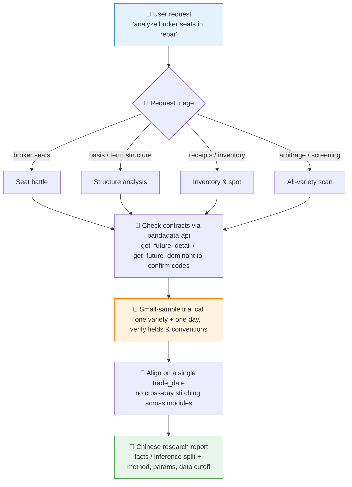
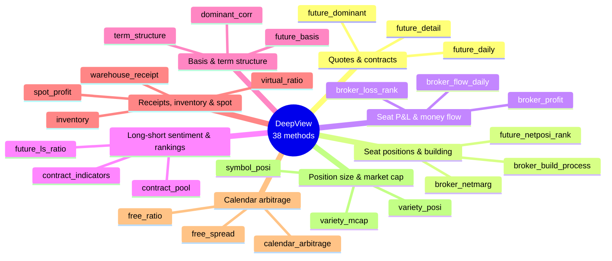

# 🔩 Futures DeepView Analyst Skill

[简体中文](README.md) | **English**

> Turns natural-language requests like "analyze the broker-seat battle in rebar" or "check soybean-meal term structure and warehouse receipts" into Pandadata futures DeepView call plans, and outputs Chinese research reports with facts and inference strictly separated.

<p align="center">
  
  
  
  
  
  
</p>

---

## 📖 What is this

`futures-deepview-analyst` is an **Agent Skill**: it teaches AI Agents (Claude Code, Codex, Cursor, …) how to combine Pandadata's **35 futures DeepView interfaces** — broker-seat net position margin, position building, profit/loss rankings, long-short ratios, money flow, basis, term structure, warehouse receipts & inventory, virtual-to-physical ratio, spot profit, calendar arbitrage — into comprehensive research on futures varieties, dominant contracts, and inter-delivery structure.

The core problem it solves: DeepView has many interfaces, mixed conventions, and large single-day snapshots. Letting an Agent call them raw tends to produce **made-up parameters, fake signals stitched across different days, and inference presented as fact**. This skill builds in four guardrails: request triage, small-sample trial calls, same-day alignment, and evidence-chain annotation.

> All data contracts come from the sibling skill [`pandadata-api`](https://github.com/quantskills/skill-pandadata-api); this skill is about *how to analyze*, not *what the interfaces look like*.

---

## ⚡ Workflow



---

## 🗂️ Interface Map (8 groups, 38 methods)



| Topic | Interfaces |
|---|---|
| 📈 Quotes & contracts | `get_future_daily` · `get_future_daily_post` · `get_future_min` · `get_future_detail` · `get_future_dominant` |
| 🪑 Seat positions, building & net long/short | `get_broker_netmarg` · `get_broker_netmarg_change` · `get_broker_totlmarg` · `get_broker_grade` · `get_broker_oi_value` · `get_broker_build_process` · `get_future_nonbroker_net` · `get_future_netposi_rank` · `get_future_netcap_change` |
| 💰 Seat P&L & money flow | `get_broker_profit` · `get_broker_variety_profit` · `get_broker_profit_rank` · `get_broker_loss_rank` · `get_broker_flow_daily` |
| ⚖️ Long-short sentiment & contract rankings | `get_future_ls_ratio` · `get_broker_ls_ratio` · `get_future_contract_indicators` · `get_future_contract_rank` · `get_future_contract_pool` · `get_future_net_flow` |
| 📐 Basis, term structure & correlation | `get_future_basis` · `get_future_term_structure` · `get_future_dominant_corr` |
| 📦 Receipts, inventory, virtual ratio & spot profit | `get_future_warehouse_receipt` · `get_future_inventory` · `get_future_virtual_ratio` · `get_future_trader_quote` · `get_future_spot_profit` |
| 🔁 Calendar arbitrage, spreads & ratios | `get_future_calendar_arbitrage` · `get_future_free_spread` · `get_future_free_ratio` |
| 🏗️ Position size & market cap | `get_future_variety_posi` · `get_future_symbol_posi` · `get_future_variety_mcap` |

---

## 🎯 Four Analysis Modes

| Mode | Typical question | Signal recipe |
|---|---|---|
| 🪑 **Seat battle** | "Are the big seats bullish on rebar?" | Price trend × net position margin × position building × P&L ranking; price/position/money aligned = confirmation, opposed = divergence |
| 📐 **Structure analysis** | "Is soybean meal in contango or backwardation?" | Basis percentile × curve shape × calendar spreads, compared on a **single-day snapshot** |
| 📦 **Inventory & spot** | "Is receipt pressure heavy? Any squeeze risk?" | Receipts/inventory MoM & YoY × virtual-to-physical ratio × spot quotes × spot profit |
| 🔍 **All-variety scan** | "Which varieties have calendar-arbitrage setups?" | Coarse screen via ranking/pool interfaces → top 5–10 verified in detail, filters fully disclosed |

Detailed signal recipes, report skeletons, and empty-data handling live in [`references/analysis-playbook.md`](references/analysis-playbook.md).

---

## 🚀 Quick Start

### 1️⃣ Install (together with pandadata-api)

This skill **depends on** `pandadata-api` for interface contracts and real call capability; install both:

```bash
# Claude Code (global)
cp -r skill-pandadata-api            ~/.claude/skills/pandadata-api
cp -r skill-futures-deepview-analyst ~/.claude/skills/futures-deepview-analyst

# Codex / OpenAI Agents (global)
mkdir -p ~/.agents/skills
cp -r skill-pandadata-api ~/.agents/skills/pandadata-api
cp -r skill-futures-deepview-analyst ~/.agents/skills/futures-deepview-analyst

# Cursor (project level)
mkdir -p .cursor/skills .cursor/rules
cp -r skill-pandadata-api .cursor/skills/pandadata-api
cp -r skill-futures-deepview-analyst .cursor/skills/futures-deepview-analyst
cp skill-futures-deepview-analyst/agents/cursor-rule.mdc .cursor/rules/futures-deepview-analyst.mdc
```

### 2️⃣ Ask in natural language

```text
分析一下螺纹钢最近20个交易日的席位博弈
看看豆粕的期限结构和仓单情况
扫描一下哪些品种存在跨期套利机会
RB2510 的虚实盘比和现货利润怎么样？
```

### 3️⃣ What the report looks like

A full report has a fixed 9-part structure:

```
Summary → Data scope → Quotes & contract background → Seat battle → Basis & term structure
→ Receipts, inventory & spot → Cross-validation → Risks & limitations → Appendix (method/params/row counts)
```

Quick Q&A compresses to four parts: **conclusion / key evidence / contradictions / data sources**.

---

## 📦 Directory Layout

```
futures-deepview-analyst/
├── SKILL.md                          # Skill entry: rules, workflow, interface map, output standards
├── references/
│   └── analysis-playbook.md          # 📒 Signal recipes, report skeletons, empty-data/conflict handling
└── agents/
    ├── cursor-rule.mdc               # Cursor rule adapter
    ├── openai.yaml                   # OpenAI/Codex adapter
    └── portable-loader.md            # Portable loader
```

---

## 📐 Core Constraints

| Constraint | Description |
|---|---|
| 🧾 Contract first | Check parameters and fields via `pandadata-api` before any call; never invent parameters from memory |
| 🧪 Small sample first | Trial-call one variety + one day; inspect `shape`, columns, and date coverage before widening the window |
| 📅 Same-day alignment | Cross-module conclusions (positions, basis, term structure, inventory, arbitrage) must share one `trade_date` |
| 🧠 Fact ≠ inference | "Net long increased" is fact; "longs are more aggressive" is inference; "guaranteed to rise" is forbidden |
| 🪟 Disclosure limits | Seat data covers only top-ranked seats per exchange rules; any "main force" reading must state this caveat |
| 🚫 No trade orders | Never outputs trading instructions; for execution hand off to `ssquant-ai-trader` / `ssquant-trader-generator` |

---

## ⚠️ Disclaimer

Output is data-driven summarization and rule-based inference, for research reference only. Nothing here constitutes investment advice.

## 📜 License

This project is licensed under the GNU General Public License v3.0. See [LICENSE](LICENSE).
