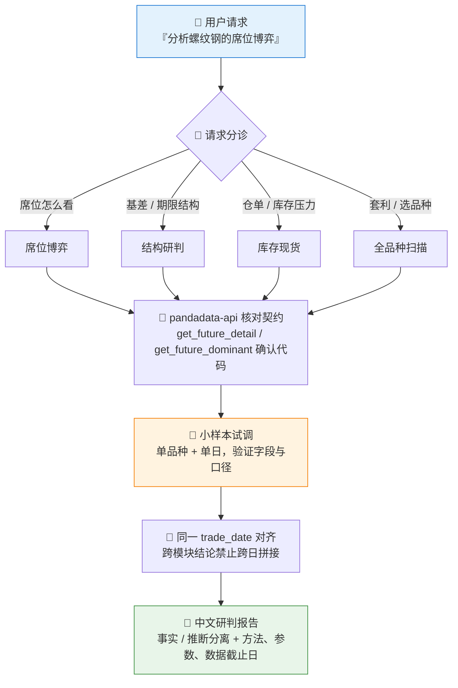
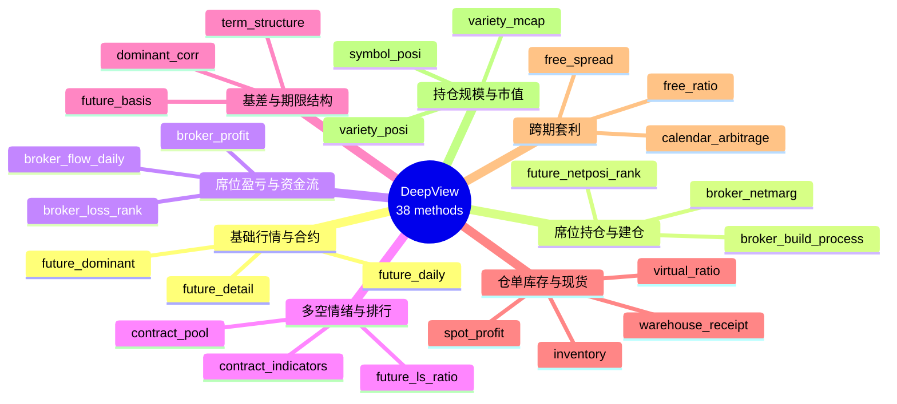

# 🔩 Futures DeepView Analyst Skill

**简体中文** | [English](README.en.md)

> 把"分析螺纹钢席位博弈""看豆粕期限结构和仓单"这类自然语言请求，转成 Pandadata 期货 DeepView 数据调用计划，输出事实与推断分离的中文研判报告。

<p align="center">
  
  
  
  
  
  
</p>

---

## 📖 这是什么

`futures-deepview-analyst` 是一个 **Agent Skill**：它教会 AI Agent（Claude Code、Codex、Cursor 等）如何组合使用 Pandadata 的 **35 个期货 DeepView 接口** —— 席位净持仓保证金、建仓过程、盈亏排行、多空比、资金流、基差、期限结构、仓单库存、虚实盘比、现货利润、跨期套利 —— 对期货品种、主力合约和跨期结构做综合研判。

它解决的核心问题：DeepView 数据接口多、口径杂、单日快照大，直接让 Agent 裸调容易**编错参数、跨日拼接出伪信号、把推断说成事实**。本技能内置了请求分诊、小样本试调、同日对齐、证据链标注四道约束。

> 数据契约一律来自姊妹技能 [`pandadata-api`](https://github.com/quantskills/skill-pandadata-api)；本技能负责"怎么分析"，不负责"接口长什么样"。

---

## ⚡ 工作流



---

## 🗂️ 接口地图（8 组 38 个方法）



| 主题 | 接口 |
|---|---|
| 📈 基础行情与合约 | `get_future_daily` · `get_future_daily_post` · `get_future_min` · `get_future_detail` · `get_future_dominant` |
| 🪑 席位持仓、建仓和净多空 | `get_broker_netmarg` · `get_broker_netmarg_change` · `get_broker_totlmarg` · `get_broker_grade` · `get_broker_oi_value` · `get_broker_build_process` · `get_future_nonbroker_net` · `get_future_netposi_rank` · `get_future_netcap_change` |
| 💰 席位盈亏和资金流 | `get_broker_profit` · `get_broker_variety_profit` · `get_broker_profit_rank` · `get_broker_loss_rank` · `get_broker_flow_daily` |
| ⚖️ 多空情绪和合约排行 | `get_future_ls_ratio` · `get_broker_ls_ratio` · `get_future_contract_indicators` · `get_future_contract_rank` · `get_future_contract_pool` · `get_future_net_flow` |
| 📐 基差、期限结构和相关性 | `get_future_basis` · `get_future_term_structure` · `get_future_dominant_corr` |
| 📦 仓单、库存、虚实盘和现货利润 | `get_future_warehouse_receipt` · `get_future_inventory` · `get_future_virtual_ratio` · `get_future_trader_quote` · `get_future_spot_profit` |
| 🔁 跨期套利和价差价比 | `get_future_calendar_arbitrage` · `get_future_free_spread` · `get_future_free_ratio` |
| 🏗️ 持仓规模和市值 | `get_future_variety_posi` · `get_future_symbol_posi` · `get_future_variety_mcap` |

---

## 🎯 四种分析模式

| 模式 | 典型问法 | 信号配方 |
|---|---|---|
| 🪑 **席位博弈** | "主力是否看多螺纹钢？" | 价格趋势 × 净持仓保证金 × 建仓过程 × 盈亏排行；价/仓/资金同向为确认，反向为背离 |
| 📐 **结构研判** | "豆粕现在 contango 还是 back？" | 基差分位 × 曲线形态 × 跨期价差，**同一交易日快照**对比 |
| 📦 **库存现货** | "仓单压力大不大？会不会逼仓？" | 仓单/库存环比同比 × 虚实盘比 × 现货报价 × 现货利润 |
| 🔍 **全品种扫描** | "哪些品种有跨期套利机会？" | 先排行/池子类接口粗筛 → Top 5-10 再做明细验证，过滤条件全程可见 |

详细信号配方、报告骨架与空数据处理见 [`references/analysis-playbook.md`](references/analysis-playbook.md)。

---

## 🚀 快速开始

### 1️⃣ 安装（与 pandadata-api 一起）

本技能**依赖** `pandadata-api` 提供接口契约与真实调用能力，两个技能需一起安装：

```bash
# Claude Code（全局）
cp -r skill-pandadata-api    ~/.claude/skills/pandadata-api
cp -r skill-futures-deepview-analyst ~/.claude/skills/futures-deepview-analyst

# Codex / OpenAI Agents（全局）
mkdir -p ~/.agents/skills
cp -r skill-pandadata-api ~/.agents/skills/pandadata-api
cp -r skill-futures-deepview-analyst ~/.agents/skills/futures-deepview-analyst

# Cursor（项目内）
mkdir -p .cursor/skills .cursor/rules
cp -r skill-pandadata-api .cursor/skills/pandadata-api
cp -r skill-futures-deepview-analyst .cursor/skills/futures-deepview-analyst
cp skill-futures-deepview-analyst/agents/cursor-rule.mdc .cursor/rules/futures-deepview-analyst.mdc
```

### 2️⃣ 直接用自然语言提问

```text
分析一下螺纹钢最近20个交易日的席位博弈
看看豆粕的期限结构和仓单情况
扫描一下哪些品种存在跨期套利机会
RB2510 的虚实盘比和现货利润怎么样？
```

### 3️⃣ 报告长什么样

完整报告固定 9 段结构：

```
摘要结论 → 数据范围 → 行情与合约背景 → 席位博弈 → 基差与期限结构
→ 仓单库存与现货 → 交叉验证 → 风险与限制 → 附录（方法/参数/行数）
```

快速问答压缩为：**结论 / 关键证据 / 矛盾点 / 数据来源** 四段。

---

## 📦 目录结构

```
futures-deepview-analyst/
├── SKILL.md                          # 技能入口：规则、工作流、接口地图、输出标准
├── references/
│   └── analysis-playbook.md          # 📒 信号配方、报告骨架、空数据/冲突处理
└── agents/
    ├── cursor-rule.mdc               # Cursor 规则适配
    ├── openai.yaml                   # OpenAI/Codex 适配
    └── portable-loader.md            # 通用加载器
```

---

## 📐 核心约束

| 约束 | 说明 |
|---|---|
| 🧾 先查契约 | 任何方法调用前先经 `pandadata-api` 核对参数与字段，不凭记忆编参数 |
| 🧪 小样本先行 | 单品种 + 单日试调，看 `shape`、列名、日期覆盖后再放大窗口 |
| 📅 同日对齐 | 持仓、基差、期限结构、库存、套利的跨模块结论必须同一 `trade_date` |
| 🧠 事实 ≠ 推断 | "净多增加"是事实，"多头更主动"是推断，"必然上涨"不允许出现 |
| 🪟 披露限制 | 席位数据受交易所披露规则限制（仅前排名席位），解读"主力"时必须声明口径 |
| 🚫 不下指令 | 不输出交易指令；用户要落地策略时移交 `ssquant-ai-trader` / `ssquant-trader-generator` |

---

## ⚠️ 免责声明

本技能输出为数据事实归纳与规则化推断，仅供研究参考，不构成任何投资建议。

## 📜 License

This project is licensed under the GNU General Public License v3.0. See [LICENSE](LICENSE).
